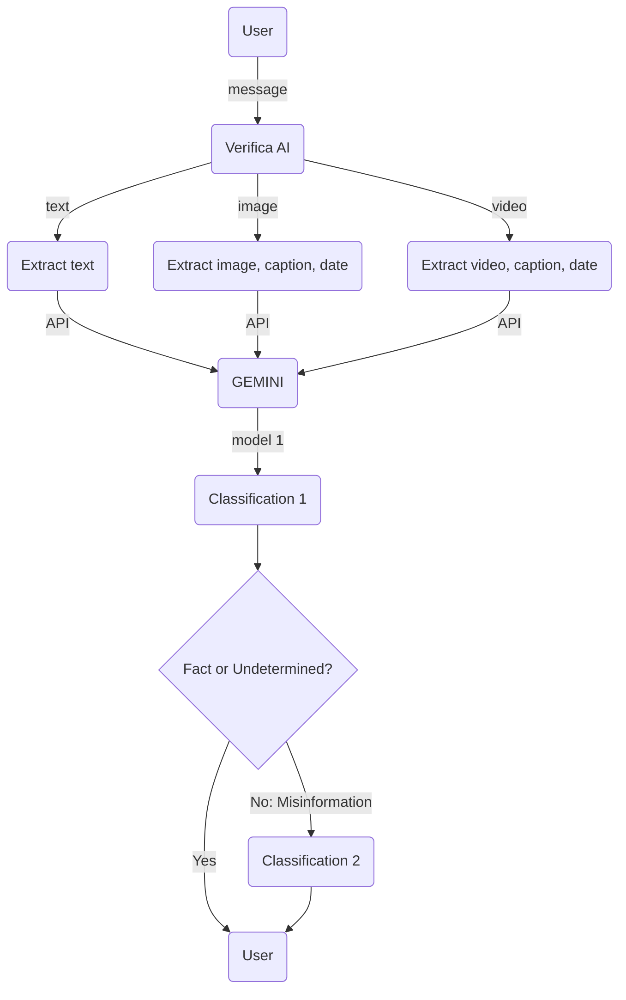
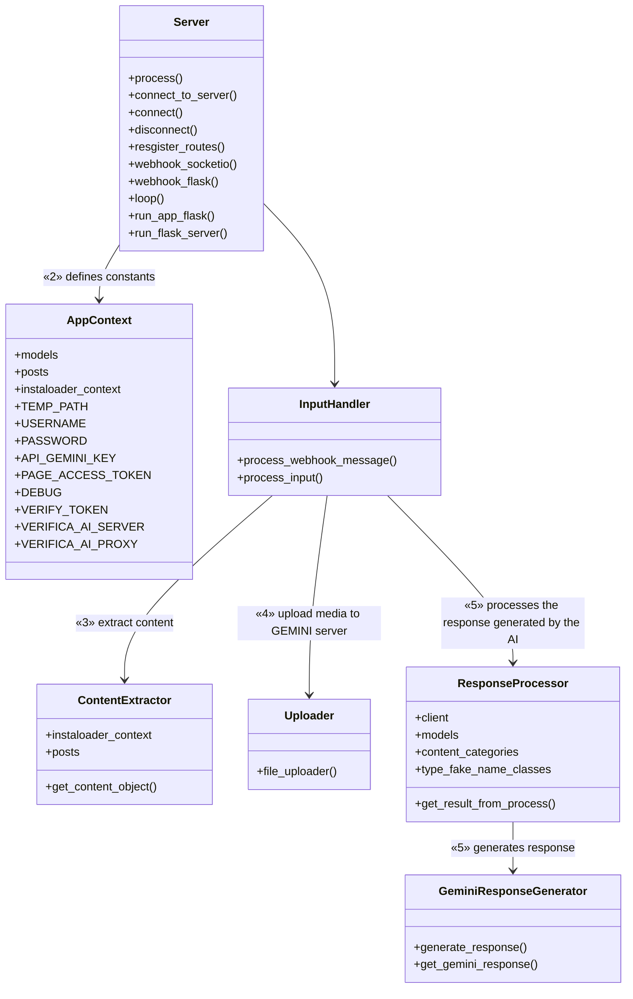
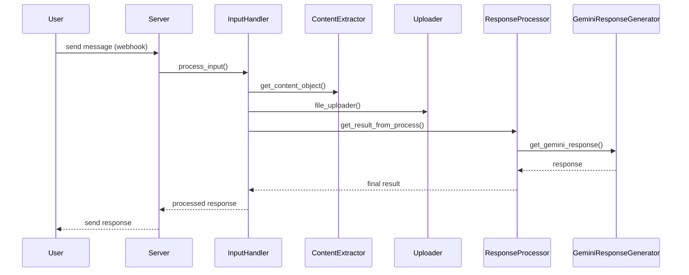

# Verifica AI

📄 **Article:** [Read the paper](https://verificaicode.github.io/verifica_ai/artigo-febrace-2025.pdf)

🌐 Language:
- 🇧🇷 [Português](README-pt.md)
- 🇺🇸 [English](current)

&nbsp;&nbsp;&nbsp;&nbsp;Verifica AI is an automated system for the analysis and verification of Instagram posts. Leveraging the Gemini API for artificial intelligence and the Instaloader library for data collection, the system assesses content veracity according to predefined misinformation categories and provides a detailed analysis with sources ranked by reliability.

---

📊 Results
- Acurácia: 97%
- Precisão: 98%
- Recall: 98%

---

🎯 Problem and Motivation

&nbsp;&nbsp;&nbsp;&nbsp;The rapid dissemination of information on social media has significantly intensified the spread of misinformation. Platforms such as Instagram present specific challenges for its detection, including the presence of multimodal content and the high velocity of information sharing.

&nbsp;&nbsp;&nbsp;&nbsp;In this context, Verifica AI was developed as an automated solution designed to analyze, classify, and contextualize potentially misleading content, contributing to the mitigation of the impacts of misinformation.

---

🗂️ Dataset
- Total samples: 200 posts  
- Distribution: 150 truthful contents and 50 contents classified as misinformation  
- Source: public Instagram posts

---

🧪 Evaluation

The system was evaluated based on the following metrics:  

- Accuracy: proportion of correct predictions  
- Precision: ratio of true positives to predicted positives  
- Recall: ratio of true positives to actual positives

⚠️ Error Analysis

Most common errors identified:

- Satirical content classified as factual  
- Difficulty in classifying AI-generated content  

⚠️ Limitations

- Small dataset size  
- Dependence on external APIs (Gemini, Instagram)  
- Potential bias in the analyzed sources  

---

## Types of Content

The system identifies the following main categories of content:

- **Fact:** A statement based on truthful information, supported by verifiable evidence and reliable sources.

- **Insufficient information:** The post contains data that cannot be confirmed or refuted due to a lack of context, details, or available evidence at the time of analysis.

- **Satire or parody:** These do not intend to cause harm but may mislead. Although they are legitimate forms of artistic expression, they can be mistaken for factual content in digital environments where information spreads rapidly. This category includes memes and posts designed to entertain, often presenting absurd or clearly out-of-context information in a harmless way.

- **False connection:** Occurs when headlines, images, or captions do not correspond to the actual content. This practice aims to attract clicks and engagement while misleading the audience.

- **Misleading content:** The misuse of truthful information to manipulate interpretation. It may involve selective presentation of data, statistics, or quotations, as well as the use of images in a misleading manner.

- **False context:** Genuine information is removed from its original context and presented in a misleading way.

- **Imposter content:** Occurs when someone impersonates a reliable source (such as institutions, news outlets, or public figures) to lend credibility to false information.

- **Manipulated content:** Genuine content (such as videos, images, or documents) is intentionally altered to deceive.

- **Fabricated content:** Entirely false content created from scratch. It may be textual, visual, or multimodal. Analyzing this type of content involves considering elements of information disorder: the agent (who creates or distributes it), the message, and the interpreters. Understanding the motivations and types of messages being disseminated is essential.

---

## Features

- Processes text, images, and videos shared via Instagram.
- Performs detailed content analysis using Gemini Large Language Models (LLMs).
- Conducts online searches to validate temporal and contextual information.
- Classifies content as fact, fake, or insufficient information.
- Sends automated responses to users via Instagram Messenger.
- Supports multiple media items in posts (sidecar).

---

## Technologies Used

- Python 3.11
- Instaloader (for downloading Instagram content)
- Google Gemini API (language model for analysis and text generation)
- Requests (for HTTP requests)
- python-dotenv (for environment variable management)
- Instagram Graph API (for messaging and webhooks)

---

## Flowchart

```mermaid
flowchart TD
    U1(User)
    B(Verifica AI)
    T1(Extract text)
    T2(Extract image, caption, date)
    T3(Extract video, caption, date)
    EG(GEMINI)
    C1(Classification 1)
    D1{Fact or Undetermined?}
    C2(Classification 2)
    U2(User)

    U1 --> |message| B

    B --> |text| T1
    B --> |image| T2
    B --> |video| T3

    T1 --> |API| EG
    T2 --> |API| EG
    T3 --> |API| EG

    EG --> |model 1| C1
    C1 --> D1

    D1 --> |Yes| U2
    D1 --> |No: Misinformation| C2
    C2 --> U2

%% classDef myStyle fill:#fff, stroke:blue, stroke-width:2px;
```

## Flow Description
**User:** Sends a message that may contain text, image, or video.

**Verifica AI:** Receives the message and, in an automated and transparent manner, extracts relevant data (text, caption, date, image, or video) and forwards it for analysis.

**Artificial Intelligence Analysis (GEMINI):**
The AI performs a primary classification, identifying whether the content is:
- Fact
- Undetermined
- Misinformation

&nbsp;&nbsp;&nbsp;&nbsp;If the content is classified as fact or undetermined, Verifica AI immediately returns the result to the user.

&nbsp;&nbsp;&nbsp;&nbsp;If the content is classified as misinformation, a second analysis is performed to determine the specific type of misinformation, among the following categories:

- Satire or parody
- False connection
- Misleading content
- False context
- Imposter content
- Manipulated content
- Fabricated content

&nbsp;&nbsp;&nbsp;&nbsp;After this step, the final result is sent to the user, who only sees the final diagnosis without access to intermediate steps.

## Class diagram

```mermaid
classDiagram
  class AppContext{
    +models
    +posts
    +instaloader_context
    +TEMP_PATH
    +USERNAME
    +PASSWORD
    +API_GEMINI_KEY
    +PAGE_ACCESS_TOKEN
    +DEBUG
    +VERIFY_TOKEN
    +VERIFICA_AI_SERVER
    +VERIFICA_AI_PROXY
  }

  class Server {
    +process()
    +connect_to_server()
    +connect()
    +disconnect()
    +resgister_routes()
    +webhook_socketio()
    +webhook_flask()
    +loop()
    +run_app_flask()
    +run_flask_server()
  }

  class InputHandler {
    +process_webhook_message()
    +process_input()
  }

  class ContentExtractor {
    +instaloader_context
    +posts
    +get_content_object()
  }

  class Uploader {
    +file_uploader()
  }

  class ResponseProcessor {
    +client
    +models
    +content_categories
    +type_fake_name_classes
    +get_result_from_process()
  }

  class GeminiResponseGenerator {
    +generate_response()
    +get_gemini_response()
  }

  Server --> AppContext : «2» defines constants
  Server --> InputHandler
  InputHandler --> ContentExtractor : «3» extract content
  InputHandler --> Uploader        : «4» upload media to GEMINI server
  InputHandler --> ResponseProcessor : «5» processes the response generated by the AI
  ResponseProcessor --> GeminiResponseGenerator : «5» generates response
```

## Sequence diagram

```mermaid
sequenceDiagram
  participant User
  participant Server
  participant InputHandler
  participant ContentExtractor
  participant Uploader
  participant ResponseProcessor
  participant GeminiResponseGenerator

  User->>Server: send message (webhook)
  Server->>InputHandler: process_input()
  InputHandler->>ContentExtractor: get_content_object()
  InputHandler->>Uploader: file_uploader()
  InputHandler->>ResponseProcessor: get_result_from_process()
  ResponseProcessor->>GeminiResponseGenerator: get_gemini_response()
  GeminiResponseGenerator-->>ResponseProcessor: response
  ResponseProcessor-->>InputHandler: final result
  InputHandler-->>Server: processed response
  Server-->>User: send response
```

---

👥 Team

Developed by:
- Aquilis Alves de Melo Oliveira
- Isabella dos Santos Caruso
- Vítor Emanuel da Silva Rodrigues

Advising:
- Abraão Lima Sousa (advisor)
- Victor Eduardo Alves da Silva Carvalho (co-advisor)

Core maintainer: @vitor-research