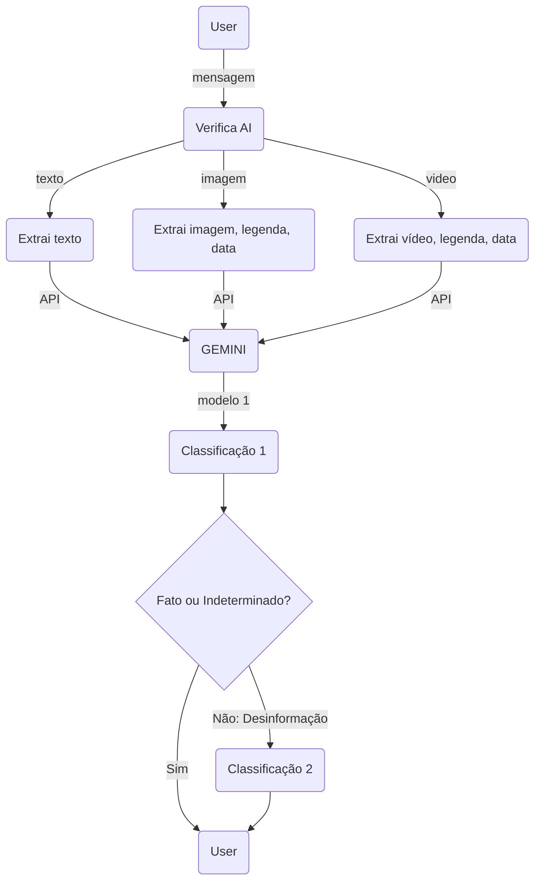

# Verifica AI

&nbsp;&nbsp;&nbsp;&nbsp;O Verifica AI é um sistema automatizado para análise e verificação de postagens do Instagram. Utilizando a API Gemini para inteligência artificial e a biblioteca Instaloader para coleta de dados, o projeto identifica a veracidade do conteúdo de acordo com os [**tipos de notícia**](#tipos-de-notícia) e fornece uma análise detalhada com fontes ordenadas por grau de confiança.

---

## Tipos de notícia

O sistema identifica 7 tipos principais de notícia:

- **Fato:** Afirmativa baseada em informações verdadeiras, sustentada por evidências verificáveis e fontes confiáveis.

- **Informações insuficientes:** A postagem apresenta dados que não podem ser confirmados ou refutados devido à falta de contexto, detalhes ou evidências disponíveis no momento da análise.

- **Sátira ou paródia:** Não têm a intenção de causar danos, mas podem enganar. Embora sejam formas legítimas de expressão artística, podem ser confundidas com fatos reais em ambientes digitais onde as informações circulam rapidamente. Entram nessa classificação os memese posts com intenção de divertir o leitor, mostrando informações absurdas ou claramente fora de contexto, ambas inofensivas.

- **Conexão falsa:** Ocorre quando títulos, imagens ou legendas não têm relação com o conteúdo da matéria. Essa prática visa atrair cliques e engajamento, mas engana o leitor ao apresentar informações desconectadas.

- **Conteúdo enganoso:** Uso distorcido de informações verdadeiras para manipular a interpretação dos fatos. Pode envolver a seleção parcial de dados, estatísticas ou citações, bem como o uso de imagens de forma a induzir a erro.

- **Contexto falso:** Informações verdadeiras são retiradas de seu contexto original e reapresentadas de maneira enganosa.

- **Conteúdo impostor:** Ocorre quando alguém se passa por uma fonte confiável (instituições, veículos de imprensa ou pessoas públicas) para dar credibilidade a informações falsas.

- **Conteúdo manipulado:** Conteúdo genuíno (como vídeos, imagens ou documentos) é alterado de forma intencional para enganar.

- **Conteúdo fabricado:** Todo o conteúdo é falso, criado do zero. Pode ser textual, visual ou multimodal. Para analisar esse tipo de conteúdo, é útil considerar os elementos da desordem informacional: o agente (quem cria, produz ou distribui), a mensagem e os intérpretes. É essencial entender as motivações dos envolvidos e os tipos de mensagens disseminadas.

---

## Funcionalidades

- Processa mensagens de texto, imagens e vídeos compartilhados via Instagram.
- Faz análise detalhada do conteúdo com auxílio de LLM (Large Language Models) Gemini.
- Realiza buscas online para validar informações temporais e contextuais.
- Classifica o conteúdo como fato, fake ou informações insuficientes.
- Envia respostas automáticas para usuários via Instagram Messenger.
- Suporta múltiplas mídias em postagens (sidecar).

---

## Tecnologias Utilizadas

- Python 3.11
- Instaloader (para baixar conteúdo do Instagram)
- Google Gemini API (modelo de linguagem para análise e geração de texto)
- Requests (para requisições HTTP)
- python-dotenv (para gerenciar variáveis de ambiente)
- APIs do Instagram Graph para mensagens e webhooks

---
## Fluxograma

### Descrição do fluxo

**Usuário:** Envia uma mensagem que pode conter texto, imagem ou vídeo.

**Verifica AI:** Recebe a mensagem e, de forma automática e transparente para o usuário, extrai os dados relevantes (texto, legenda, data, imagem ou vídeo) e os envia para análise.

**Análise com Inteligência Artificial (GEMINI):**
A IA realiza uma classificação primária, identificando se o conteúdo é:
- Fato
- Indeterminado
- Desinformação

&nbsp;&nbsp;&nbsp;&nbsp;Se o conteúdo for fato ou indeterminado, o Verifica AI retorna imediatamente o resultado ao usuário.

&nbsp;&nbsp;&nbsp;&nbsp;Se o conteúdo for classificado como desinformação, uma segunda análise é realizada para identificar o tipo específico de desinformação, entre as seguintes categorias:

- Sátira ou paródia
- Conexão falsa
- Conteúdo enganoso
- Contexto falso
- Conteúdo impostor
- Conteúdo manipulado
- Conteúdo fabricado

&nbsp;&nbsp;&nbsp;&nbsp;Após essa etapa, o resultado final é enviado ao usuário, que vê apenas o diagnóstico final, sem ter acesso às etapas intermediárias.

---
## Diagrama de classes

## Diagrama de sequência

